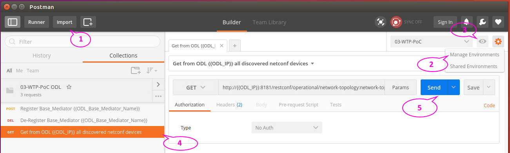

#### Register ONF CENTENNIAL PoC 3 Base Mediator to OpendayLight 

The OpenDaylight configuration is done with the Rest Client "Postman" that you can get from here: https://www.getpostman.com/.

Postman runs on top of google chrome. The steps below are executed on Google Chrome with Windows 10 PC and Ubuntu 16.04.1 LTS Base_Mediator Server.
  
The test setup needs:

* OpenDaylight running with all plugins for this PoC and a route to the Base_Mediator Server
* OpenDaylight supports the standard login admin/admin
* Base_Mediator Server running with startet OpenYuma/NETCONF service

The setup uses the following variables.
**Adapt this Variables to your environment.** 

Variables | Start values | Meaning
----------|------------|---------
*ODL_IP* | sendateodl | IP Adress or hostname of OpenDaylight Server
*ODL_Base_Mediator_Name* | base-mediator3 | Unique name of endpoint in OpenDaylight
*Base_Mediator_IP* | 192.168.2.125 | IP Adress or hostname of Base_Mediator Server
*Base_Mediator_User* | compila | Username to login via ssh to Base_Mediator Server on NETCONF port
*Base_Mediator_UserPassword* | compila+ |  Password of user to login via ssh to Base_Mediator Server

##### Prepare Postman

The steps refer to the number of the Postman windows in the screenshot below.

1. Import *Postman_collection_ToRegister.json*
2. Import *Postman_environment.json*
3. Choose Environment "03-WTP-Poc" and provide the rights values to the environment variables
4. Choose Get command
5. Press the send button to get an answer back from ODL




##### Register Base Mediator

First of all the Base_Mediator endpoint needs a registration in ODL. Use the "Register Base Mediator" message.
After send there should be an empty body as positive feedback. The OpenYuma Server should show messages indicating a connection setup to the ODL Server. See last part of Base Mediator output below.
If you send a second time the response is like this:

```
    <errors xmlns="urn:ietf:params:xml:ns:yang:ietf-restconf">
        <error>
            <error-type>protocol</error-type>
            <error-tag>data-exists</error-tag>
            <error-message>Data already exists for path: /(urn:opendaylight:params:xml:ns:yang:controller:config?revision=2013-04-05)modules/module/module[{(urn:opendaylight:params:xml:ns:yang:controller:config?revision=2013-04-05)type=(urn:opendaylight:params:xml:ns:yang:controller:md:sal:connector:netconf?revision=2015-08-03)sal-netconf-connector, (urn:opendaylight:params:xml:ns:yang:controller:config?revision=2013-04-05)name=base-mediator3}]</error-message>
        </error>
    </errors>
```

##### De-Register Base Mediator

The command to de-register is "De-Register". After send there should be an empty body as positive feedback. If the endpoint is not available an error response is generated.

##### Get Base Mediator configuration

Use the command Get from ODL. The response shows a list of all endpoints known to ODL and its status and configurations.
Scroll to see the Base Mediator endpoint. 

##### Example of Get


The following screenshot shows the steps to see an example of a correct get result. 
This answer was created at a testbed with the start value configuration and is part of the JSON import file.

1. Click the small triangle to see the Saved Responses.
2. Click the htTestBedAnswer to see this response in the lower part of postman window
3. Study the section with the Base_Mediator name "base_mediator3".  


##### Base Mediator Output

This output was created to stdout directly after service startup:
```  
compila@compila-virtual-machine:~$     netconfd  --log-level=debug --access-control=off --target=running --no-startup \
>       --module=CoreModel-CoreNetworkModule-ObjectClasses \
>       --module=MicrowaveModel-ObjectClasses-AirInterface \
>       --module=MicrowaveModel-ObjectClasses-PureEthernetStructure \
>       --module=MicrowaveModel-ObjectClasses-EthernetContainer
Starting netconfd...
Copyright (c) 2008-2012, Andy Bierman, All Rights Reserved.
Copyright (c) 2013-2015, Vladimir Vassilev, All Rights Reserved.
Copyright (c) 2012-2016, OpenClovis Inc, All Rights Reserved.

load_module called for 'yuma-ncx'
Loading YANG module from file:
  yuma-ncx.yang
Loading YIN module from file:
  yuma-ncx.yin
Loading YANG module from file:
  /usr/share/yuma/modules/netconfcentral/yuma-ncx.yang
load_module called for 'yuma-netconf'
Loading YANG module from file:
  yuma-netconf.yang
Loading YIN module from file:
  yuma-netconf.yin
Loading YANG module from file:
  /usr/share/yuma/modules/netconfcentral/yuma-netconf.yang
load_module called for 'ietf-inet-types'
Loading YANG module from file:
  ietf-inet-types.yang
Loading YIN module from file:
  ietf-inet-types.yin
Loading YANG module from file:
  /usr/share/yuma/modules/yang/ietf-inet-types.yang
load_module called for 'ietf-yang-types'
Loading YANG module from file:
  ietf-yang-types.yang
Loading YIN module from file:
  ietf-yang-types.yin
Loading YANG module from file:
  /usr/share/yuma/modules/yang/ietf-yang-types.yang
load_module called for 'netconfd'
Loading YANG module from file:
  netconfd.yang
Loading YIN module from file:
  netconfd.yin
Loading YANG module from file:
  /usr/share/yuma/modules/netconfcentral/netconfd.yang
Warning: line is 82 chars, limit is 72 chars
netconfd.yang:26.1: warning(438): display line length exceeded

Warning: line is 77 chars, limit is 72 chars
netconfd.yang:342.1: warning(438): display line length exceeded

Warning: line is 74 chars, limit is 72 chars
netconfd.yang:352.1: warning(438): display line length exceeded

Warning: line is 82 chars, limit is 72 chars
netconfd.yang:361.1: warning(438): display line length exceeded

load_module called for 'yuma-types'
Loading YANG module from file:
  yuma-types.yang
Loading YIN module from file:
  yuma-types.yin
Loading YANG module from file:
  /usr/share/yuma/modules/netconfcentral/yuma-types.yang
load_module called for 'yuma-app-common'
Loading YANG module from file:
  yuma-app-common.yang
Loading YIN module from file:
  yuma-app-common.yin
Loading YANG module from file:
  /usr/share/yuma/modules/netconfcentral/yuma-app-common.yang
load_module called for 'ietf-netconf-with-defaults'
Loading YANG module from file:
  ietf-netconf-with-defaults.yang
Loading YIN module from file:
  ietf-netconf-with-defaults.yin
Loading YANG module from file:
  /usr/share/yuma/modules/ietf/ietf-netconf-with-defaults.yang
Skipping import of ietf-netconf, using yuma-netconf instead
load_module called for 'ietf-netconf-acm'
Loading YANG module from file:
  ietf-netconf-acm.yang
Loading YIN module from file:
  ietf-netconf-acm.yin
Loading YANG module from file:
  /usr/share/yuma/modules/ietf/ietf-netconf-acm.yang
load_module called for 'yuma-mysession'
Loading YANG module from file:
  yuma-mysession.yang
Loading YIN module from file:
  yuma-mysession.yin
Loading YANG module from file:
  /usr/share/yuma/modules/netconfcentral/yuma-mysession.yang
load_module called for 'yuma-system'
Loading YANG module from file:
  yuma-system.yang
Loading YIN module from file:
  yuma-system.yin
Loading YANG module from file:
  /usr/share/yuma/modules/netconfcentral/yuma-system.yang
load_module called for 'ietf-system'
Loading YANG module from file:
  ietf-system.yang
Loading YIN module from file:
  ietf-system.yin
Loading YANG module from file:
  /usr/share/yuma/modules/ietf/ietf-system.yang
load_module called for 'iana-crypt-hash'
Loading YANG module from file:
  iana-crypt-hash.yang
Loading YIN module from file:
  iana-crypt-hash.yin
Loading YANG module from file:
  /usr/share/yuma/modules/ietf/iana-crypt-hash.yang
load_module called for 'notifications'
Loading YANG module from file:
  notifications.yang
Loading YIN module from file:
  notifications.yin
Loading YANG module from file:
  /usr/share/yuma/modules/ietf/notifications.yang
load_module called for 'ietf-system'
load_module called for 'ietf-netconf-monitoring'
Loading YANG module from file:
  ietf-netconf-monitoring.yang
Loading YIN module from file:
  ietf-netconf-monitoring.yin
Loading YANG module from file:
  /usr/share/yuma/modules/ietf/ietf-netconf-monitoring.yang
load_module called for 'notifications'
load_module called for 'nc-notifications'
Loading YANG module from file:
  nc-notifications.yang
Loading YIN module from file:
  nc-notifications.yin
Loading YANG module from file:
  /usr/share/yuma/modules/ietf/nc-notifications.yang
load_module called for 'yuma-proc'
Loading YANG module from file:
  yuma-proc.yang
Loading YIN module from file:
  yuma-proc.yin
Loading YANG module from file:
  /usr/share/yuma/modules/netconfcentral/yuma-proc.yang
load_module called for 'ietf-netconf-partial-lock'
Loading YANG module from file:
  ietf-netconf-partial-lock@2009-10-19.yang
Loading YIN module from file:
  ietf-netconf-partial-lock@2009-10-19.yin
load_module called for 'ietf-netconf-partial-lock'
Loading YANG module from file:
  ietf-netconf-partial-lock.yang
Loading YIN module from file:
  ietf-netconf-partial-lock.yin
Loading YANG module from file:
  /usr/share/yuma/modules/ietf/ietf-netconf-partial-lock.yang
load_module called for 'yuma-time-filter'
Loading YANG module from file:
  yuma-time-filter@2011-08-13.yang
Loading YIN module from file:
  yuma-time-filter@2011-08-13.yin
load_module called for 'yuma-time-filter'
Loading YANG module from file:
  yuma-time-filter.yang
Loading YIN module from file:
  yuma-time-filter.yin
Loading YANG module from file:
  /usr/share/yuma/modules/netconfcentral/yuma-time-filter.yang
load_module called for 'yuma-arp'
Loading YANG module from file:
  yuma-arp@2012-01-13.yang
Loading YIN module from file:
  yuma-arp@2012-01-13.yin
load_module called for 'yuma-arp'
Loading YANG module from file:
  yuma-arp.yang
Loading YIN module from file:
  yuma-arp.yin
Loading YANG module from file:
  /usr/share/yuma/modules/netconfcentral/yuma-arp.yang

netconfd final CLI + .conf parameters:

netconfd {
  access-control off
  default-style explicit
  delete-empty-npcontainers false
  eventlog-size 1000
  feature-enable-default true
  hello-timeout 600
  idle-timeout 3600
  indent 2
  log-level debug
  max-burst 10
  max-sessions 1024
  module CoreModel-CoreNetworkModule-ObjectClasses
  module MicrowaveModel-ObjectClasses-AirInterface
  module MicrowaveModel-ObjectClasses-PureEthernetStructure
  module MicrowaveModel-ObjectClasses-EthernetContainer
  running-error stop
  no-startup
  startup-error continue
  subdirs true
  system-sorted true
  target running
  warn-idlen 64
  warn-linelen 0
  with-startup false
  with-url true
  with-validate true
}

Warning: SIL code for module 'CoreModel-CoreNetworkModule-ObjectClasses' not found
load_module called for 'CoreModel-CoreNetworkModule-ObjectClasses'
Loading YANG module from file:
  CoreModel-CoreNetworkModule-ObjectClasses.yang
Loading YIN module from file:
  CoreModel-CoreNetworkModule-ObjectClasses.yin
Loading YANG module from file:
  /usr/share/yuma/modules/CENTENNIAL/CoreModel-CoreNetworkModule-ObjectClasses@2016-08-11.yang
load_module called for 'CoreModel-CoreFoundationModule-SuperClassesAndCommonPackages'
Loading YANG module from file:
  CoreModel-CoreFoundationModule-SuperClassesAndCommonPackages.yang
Loading YIN module from file:
  CoreModel-CoreFoundationModule-SuperClassesAndCommonPackages.yin
Loading YANG module from file:
  /usr/share/yuma/modules/CENTENNIAL/CoreModel-CoreFoundationModule-SuperClassesAndCommonPackages@2016-07-10.yang
load_module called for 'CoreModel-CoreFoundationModule-StateModel'
Loading YANG module from file:
  CoreModel-CoreFoundationModule-StateModel.yang
Loading YIN module from file:
  CoreModel-CoreFoundationModule-StateModel.yin
Loading YANG module from file:
  /usr/share/yuma/modules/CENTENNIAL/CoreModel-CoreFoundationModule-StateModel@2016-08-09.yang
load_module called for 'CoreModel-CoreNetworkModule-TypeDefinitions'
Loading YANG module from file:
  CoreModel-CoreNetworkModule-TypeDefinitions.yang
Loading YIN module from file:
  CoreModel-CoreNetworkModule-TypeDefinitions.yin
Loading YANG module from file:
  /usr/share/yuma/modules/CENTENNIAL/CoreModel-CoreNetworkModule-TypeDefinitions@2016-07-10.yang
Warning: SIL code for module 'MicrowaveModel-ObjectClasses-AirInterface' not found
load_module called for 'MicrowaveModel-ObjectClasses-AirInterface'
Loading YANG module from file:
  MicrowaveModel-ObjectClasses-AirInterface.yang
Loading YIN module from file:
  MicrowaveModel-ObjectClasses-AirInterface.yin
Loading YANG module from file:
  /usr/share/yuma/modules/CENTENNIAL/MicrowaveModel-ObjectClasses-AirInterface@2016-09-01.yang
load_module called for 'MicrowaveModel-TypeDefinitions'
Loading YANG module from file:
  MicrowaveModel-TypeDefinitions.yang
Loading YIN module from file:
  MicrowaveModel-TypeDefinitions.yin
Loading YANG module from file:
  /usr/share/yuma/modules/CENTENNIAL/MicrowaveModel-TypeDefinitions@2016-09-02.yang
load_module called for 'MicrowaveModel-ObjectClasses-SuperClasses'
Loading YANG module from file:
  MicrowaveModel-ObjectClasses-SuperClasses.yang
Loading YIN module from file:
  MicrowaveModel-ObjectClasses-SuperClasses.yin
Loading YANG module from file:
  /usr/share/yuma/modules/CENTENNIAL/MicrowaveModel-ObjectClasses-SuperClasses@2016-08-09.yang
load_module called for 'CoreModel-CoreFoundationModule-TypeDefinitions'
Loading YANG module from file:
  CoreModel-CoreFoundationModule-TypeDefinitions.yang
Loading YIN module from file:
  CoreModel-CoreFoundationModule-TypeDefinitions.yin
Loading YANG module from file:
  /usr/share/yuma/modules/CENTENNIAL/CoreModel-CoreFoundationModule-TypeDefinitions@2016-07-01.yang
load_module called for 'G_874_1_model-Object_Classes'
Loading YANG module from file:
  G_874_1_model-Object_Classes.yang
Loading YIN module from file:
  G_874_1_model-Object_Classes.yin
Loading YANG module from file:
  /usr/share/yuma/modules/CENTENNIAL/G_874_1_model-Object_Classes@2016-07-10.yang
load_module called for 'G_874_1_model-Imported_Information_Object_Classes-Q_822'
Loading YANG module from file:
  G_874_1_model-Imported_Information_Object_Classes-Q_822.yang
Loading YIN module from file:
  G_874_1_model-Imported_Information_Object_Classes-Q_822.yin
Loading YANG module from file:
  /usr/share/yuma/modules/CENTENNIAL/G_874_1_model-Imported_Information_Object_Classes-Q_822@2016-08-11.yang
load_module called for 'G_874_1_model-Imported_Information_Object_Classes-X_739'
Loading YANG module from file:
  G_874_1_model-Imported_Information_Object_Classes-X_739.yang
Loading YIN module from file:
  G_874_1_model-Imported_Information_Object_Classes-X_739.yin
Loading YANG module from file:
  /usr/share/yuma/modules/CENTENNIAL/G_874_1_model-Imported_Information_Object_Classes-X_739@2016-07-10.yang
load_module called for 'G_874_1_model-Imported_Information_Object_Classes-X_721'
Loading YANG module from file:
  G_874_1_model-Imported_Information_Object_Classes-X_721.yang
Loading YIN module from file:
  G_874_1_model-Imported_Information_Object_Classes-X_721.yin
Loading YANG module from file:
  /usr/share/yuma/modules/CENTENNIAL/G_874_1_model-Imported_Information_Object_Classes-X_721@2016-07-10.yang
load_module called for 'G_874_1_model-Imported_Data_Types'
Loading YANG module from file:
  G_874_1_model-Imported_Data_Types.yang
Loading YIN module from file:
  G_874_1_model-Imported_Data_Types.yin
Loading YANG module from file:
  /usr/share/yuma/modules/CENTENNIAL/G_874_1_model-Imported_Data_Types@2016-07-10.yang
load_module called for 'G_874_1_model-Type_Definitions'
Loading YANG module from file:
  G_874_1_model-Type_Definitions.yang
Loading YIN module from file:
  G_874_1_model-Type_Definitions.yin
Loading YANG module from file:
  /usr/share/yuma/modules/CENTENNIAL/G_874_1_model-Type_Definitions@2016-07-10.yang
Warning: SIL code for module 'MicrowaveModel-ObjectClasses-PureEthernetStructure' not found
load_module called for 'MicrowaveModel-ObjectClasses-PureEthernetStructure'
Loading YANG module from file:
  MicrowaveModel-ObjectClasses-PureEthernetStructure.yang
Loading YIN module from file:
  MicrowaveModel-ObjectClasses-PureEthernetStructure.yin
Loading YANG module from file:
  /usr/share/yuma/modules/CENTENNIAL/MicrowaveModel-ObjectClasses-PureEthernetStructure@2016-09-02.yang
Warning: SIL code for module 'MicrowaveModel-ObjectClasses-EthernetContainer' not found
load_module called for 'MicrowaveModel-ObjectClasses-EthernetContainer'
Loading YANG module from file:
  MicrowaveModel-ObjectClasses-EthernetContainer.yang
Loading YIN module from file:
  MicrowaveModel-ObjectClasses-EthernetContainer.yin
Loading YANG module from file:
  /usr/share/yuma/modules/CENTENNIAL/MicrowaveModel-ObjectClasses-EthernetContainer@2016-09-02.yang
Setting initial transaction ID file to default
No initial transaction ID file found; Setting running config initial transaction id to '0'
agt: Startup configuration skipped due to no-startup CLI option

agt_sys: generating <sysStartup> notification
agt_proc: skipping <cpu> line 'bugs    :
'
netconfd init OK, ready for sessions

Running netconfd server (2.5-5)
```

OpenDaylight connects to the Base Mediator:
  
```  
New session 1 created OK
agt_connect got node
agt_connect msg ok
agt_sys: generating <sysSessionStart> notification
Session 1 for compila@192.168.2.134 now active (base:1.1)
agt_rpc: <get> for 1=compila@192.168.2.134 (m:m-0) [2016-10-05T17:49:32Z]
```  


