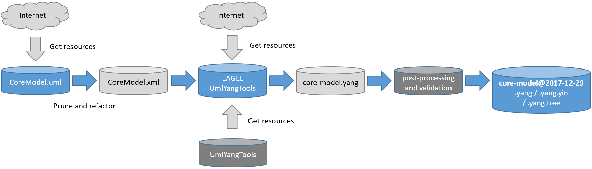

# Tools
This folder contains a couple of scripts and tools, needed to generate YANG files from UML.

### Table of Contents
1. [Prerequisites](#prerequisites)
2. [Process](#process)
2. [Main Scripts](#main-scripts)

## Prerequisites

### Operating System

The expected operating system is "Ubuntu (64-bit)". Code and scripts are devloped for:

```
$ lsb_release -a
No LSB modules are available.
Distributor ID:	Ubuntu
Description:	Ubuntu 17.10
Release:	17.10
Codename:	artful
```

However, it is assumed that the tool will run on other Linux versions too.

### Java

The Java Runtime Virtual Machine should depend on the Java versions of other important OpenSource projects, such as
- [OpenDaylight](http://docs.opendaylight.org/en/stable-nitrogen/release-notes/index.html?highlight=Java)
- [ONAP](https://wiki.onap.org/display/DW/Setting+Up+Your+Development+Environment)
- [ONOS](https://wiki.onosproject.org/display/ONOS/Requirements)

The current used version is Java 8.

The following command was used to install Java 8:
```
sudo apt-get install openjdk-8-jdk
```

### Node.js

[Node.js](https://nodejs.org/en/) is required by the [ONF UmlYangTool](https://github.com/OpenNetworkingFoundation/EAGLE-Open-Model-Profile-and-Tools/tree/ToolChain/UmlYangTools).
The following commands were used to install the latest version of Node.js:
```
sudo apt-get install nodejs npm jq --
sudo ln -s /usr/bin/nodejs /usr/bin/node
```

### Python

Python is required by pyang. Please see next chapter

The following commands were used to install Java 8:
```
sudo apt-get install python-setuptools
sudo python setup.py install
```

### Pyang

[Pyang](https://github.com/mbj4668/pyang) is needed to validate generated Yang modules and to convert them to yang.tree or yin format.

The following commands were used to install pyang:
```
git clone https://github.com/mbj4668/pyang.git
cd pyang
sudo apt-get install python-setuptools
sudo python setup.py install
cd ..
```

### UnZip

The [Saxon XSLT processor](http://saxon.sourceforge.net/) and the [ONF CoreModel v1.3](https://www.dropbox.com/sh/zns6hihpk2du7k4/AABAYA8ON1edlSAJ8jLBzoZEa/TR%20512%20v1.3/TR-512_v1._3_Publish.zip) can be downloaded as zip files from the internet.
UnZip is used to extract such files by command line.

The following commands was used to install UnZip.
```
sudo apt-get install unzip
```

## Process

The way and steps which needs to be taken to get a valid Yang module from and UML model is called "Process". 

## Ideal process

The following figure shows an "ideal" process for converting UML models according [ONF UML Guidelines](https://www.opennetworking.org/wp-content/uploads/2014/11/IISOMI_514_UML_Modeling_Guidelines_v1.2.pdf) into YANG modules.
Basically the UML model and the UMLYangTool could be downloaded (or cloned for a git repository) and by following the tool documentation a valid YANG model is generated which can be used for code generation (e.g. by ODL, ONOS or other tools.).

There might be very good reasons for additional steps in this process. Some of them are documented in the next chapter.


## Current process

However, the current process is much more complex. The UML needs to be modified (prune and refactor) so that it can be consumed by the UmlYANGTool. Also the UmlYangTool itself was modified and in addition a "post-processing" step was introduced to get a valid Yang module.

The target for three additional steps - Pruning and Refactoring, Modification of UmlYangTool and Post-processing - was to minimize the impact on the UML model and on the UmlYangTool. However, several decision were made which are questionable and requires further discussions and agreements.
The additional steps depend on each other, which further increases the complexity. 



### Pruning and refactoring

UML modules developed with Eclipse Papyrus are xml files. The UmlYangTool requires as input also in xml file.
In order to modify the CoreModel.uml [XSLT 3.0](https://en.wikipedia.org/wiki/XSLT) was chosen to generate a pruned and refactored CoreModel.xml.

The [prune-and-refactor.xslt](./src/main/prune-and-refactor/prune-and-refactor.xslt) provides the following functions.

1. [Removal of explanatory packages](#removal-of-explanatory-packages)
2. [Adding key definitions in UML](#adding-key-definitions-in-uml)
3. [Removal of selected UML elements](#removal-of-selected-uml-elements)
4. [Individual modification of attributes](#individual-modification-of-attributes)

#### Removal of explanatory packages

The current CoreModel.uml includes several packages, which are created as examples and should explain the model. Such packages must not be part of a data model and will be removed. The file [packagesBlackList.xml](./home/demx8as6/workspace/onf/CENTENNIAL/models/tools/src/main/prune-and-refactor/packagesBlackList.xml/packagesBlackList.xml) lists all packages which will be removed.

#### Adding key definitions in UML

The yang "key" statement defines an index attribute to address entries in lists. In UML such attributes can be identified by using the "partOfObjectKey" statement of the OpenModel_Profile. Currently the CoreModel v1.3 does not define any yang-key (also not necessary as it is an information model and not a data model?!?!). 

Two cases must be distinguished.

1. There is already an attribute in an object class, which could act as key (e.g. uuid of LogicalTerminationClass). In this case simply the attribute will be marked as "partOfObjectKey". The list of such attributes can defined in [keys.xml](-/src/main/prune-and-refactor/keys.xml).

2. An object class does not provide any attribute, which can work act as yang-key. In this case the object class will get a generalization tag from the GlobalClass. This way the object class will have an uuid attribute, which will be the yang-key. (Note - this is easy to implement to solve the problem, but also such object class, will now have all the other attributes of the GlobalClass. Alternatives could be: add automatically only a uuid attribute or manually change the CoreModel -> 1.4). Please see the list of such object classes: The list of such attributes can defined in [classesWithoutKey.xml](-/src/main/prune-and-refactor/classesWithoutKey.xml).

#### Removal of selected UML elements

The [removed.xml](-/src/main/prune-and-refactor/removed.xml) provides a couple of Enums and Attributes and there reason, why they are removed from the CoreModel.

#### Individual modification of attributes

Individual changes are directly coded in [prune-and-refactor.xslt](./src/main/prune-and-refactor/prune-and-refactor.xslt). In most of the cases a type of an attribute is defined or modified. The most critical change is the type modification of the localId in the LocalClass from "NameAndValue" to a simple string. This way object classes inherit from LocalClass (e.g. LayerProtocol) can use the localId as yang-key attribute.

### Modification of UmlYangTool

A few changes were necessary in the UmlYangTool on the way to a valid YANG generation.
The modified javascript files are:
- [main.js](./src/main/docs/main.js.png)
- [model/yang/util.js](./src/main/docs/util.js.png)
- [model/yang/type.js](./src/main/docs/type.js.png)
- [project/config.txt](./src/main/docs/config.txt.png)

The modifications in "config.txt" are intended. For OpenDaylight Java code generation it mandatory to set the parameter "withSuffix" to the value "Y". 

### Post-processing

The post-processing modifies the generated yang module from UmlYangTools by adding all RootElements (container and lists) and by find and replace values of yang path statements, which could not be correctly generate (please note that tha automatic generation of such pathes is a very complex task.) As the RootContainer of the CoreModel the object class "ControlComponent" was chosen, please see [add-partial.yang](./src/main/xmi2yang/post-processing/add-partial.yang). 

All the root lists are defined in [root-lists.json](./src/main/xmi2yang/post-processing/root-lists.json). The default values for such lists are 
- key uuid
- uses <object-class-in-yang-format>-g
- description "none"
and can be overwritten in the json file.

All the modification with "find/replace" are defined in [find-replace.json](./src/main/xmi2yang/post-processing/find-replace.json).

### Get resources/

```javascript
// [sko] Is the following link the right one for downloading the CoreModel v1.3?
//       https://www.dropbox.com/sh/zns6hihpk2du7k4/AABAYA8ON1edlSAJ8jLBzoZEa/TR%20512%20v1.3/TR-512_v1._3_Publish.zip
//
//       Is there a way to directly address the CoreModel.uml - in an ONF git? 
//       This way it would be also possible to track the changes between the releases.
//
//       For automation purposes UnZip is required, when UML models are available in a zip file only.
```

## Main scripts

Three scripts are available to run a set of commands for converting UML to Yang.

### 01-get-resources

The script automatically downloads the required external rescoures (e.g. UmlYangTools, SAXON, ...) and modifies them if needed. This way the entire UML to Yang generation environment is created. 

Usually this script should be excecuted only once. Please note that this script deletes all files in folder './src/main/resources'.

### 02-prune-and-refactor

The script modidifies the [Papyrus](https://www.eclipse.org/papyrus/) CoreModel.uml file, in order to automatically convert the infomration model (UML) into a data model (YANG).

Basically the all explainmentary Object Classes and Diagrams are removed, type definitions are corrected and yang keys are added.

The result will be used as input for the UmlYangTool.

### 03-uml-to-yang

Finally the this script will run the commands to generate yang modules, yang trees and yin modules form the pruned and refactord UML modules.

The output will be copied into the target folder.
