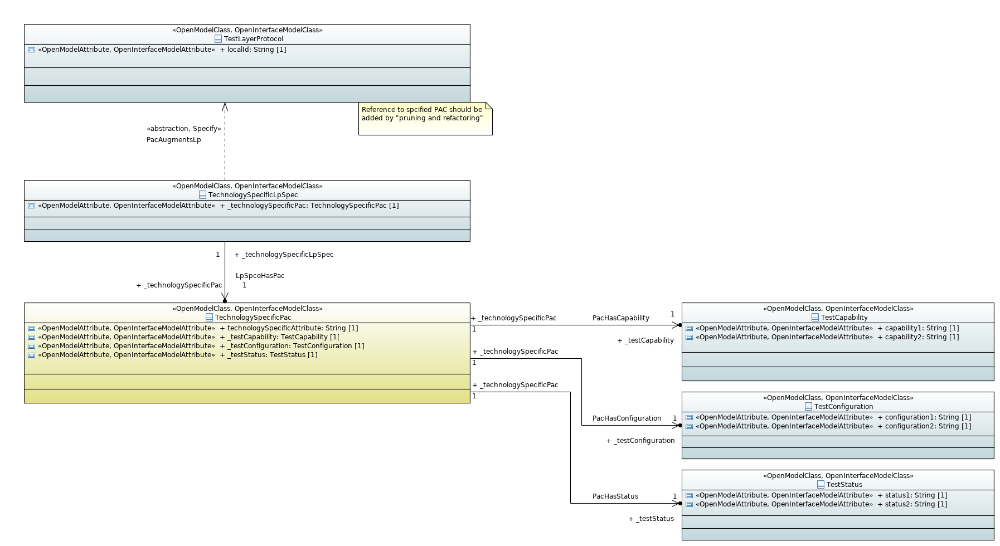
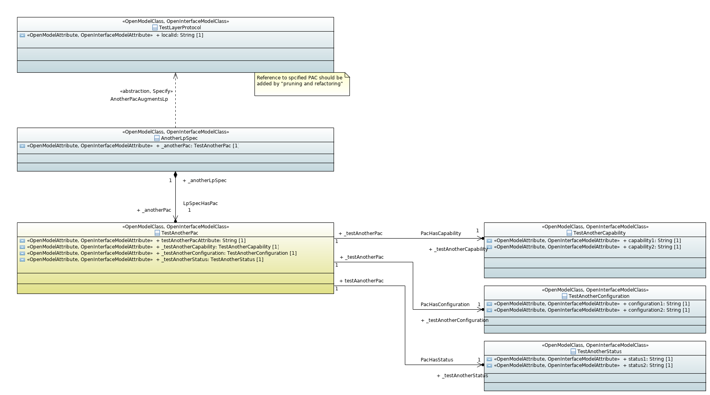

> # Revision History 
> Following are the customizations made to the original xmi2yang tool-v1.3 to support ONF Core Information Model and its technology specific extensions ,
> 1.	Included _**pruning and refactoring**_ mechanism to adapt the ONF Core Information Model as per the MicroWave device requirements.
> 2.	Added _**PostProcessing script**_ to handle the limitations of the original xmi2yang tool-v1.3 : _Mainly to include augment and when statements for the technology specific extensions of the ONF Core Information Model_.
> 3.	_**Mandatory sub statements**_ will be included if multiplicity of an attribute is [1] and no default specified  in the UML modelling.
> 4.	Enhanced the tool to include _**require-instance**_ sub statement for the leafref statement. _As per the UML to YANG Guidelines (TR531) in the section 5.6.1 Mapping of Associations , If a “LifecycleAggregate” openModel_Profile profile is available , then > require-instance statement will not available for the leaf-ref (means its require-instance=true by default)._
> 5.	In the UML2YANG mapping guidelines , there is no mapping available for indicating the _**“require-instance” property of the instanceIdentifier**_ datatype. So , included a custom profile named “5GxhaulModelProfile” with the > stereotype 5GxhaulModelAttribute /requireInstanceAtInstanceIdentifier to specify the same. (The profile shall be downloaded from [here](https://github.com/OpenNetworkingFoundation/5G-xHaul/blob/experimental/models/tools/customProfiles/5GxhaulModelProfile.zip)).

# xmi-converter

A project that converts xmi (papyrus uml) into other formats, with focus on yang.
The current version is experimental and used to understand and improve IISOMI UML-Guidelines, UML-YANG-Guidelines and the UML-YANG-Tools.

For the translation of Papyrus UML in xmi format to yang the [EagleUmlYang](https://github.com/OpenNetworkingFoundation/EagleUmlYang) tool was copied (commit 7db0e718daba597cd0654adb2eb873505be48fa6). All modifications made here should be contributed back.

## How to get here

This project is under the branch "experimental" of https://github.com/OpenNetworkingFoundation/5G-xHaul.

```bash
mkdir -p $HOME/workspace
cd $HOME/workspace
git clone https://github.com/OpenNetworkingFoundation/5G-xHaul
cd 5G-xHaul
git checkout experimental
cd models/tools
```

## Prerequisites

In order to run the UML-TO-YANG tool and verify the generated yang modules, the following tools and applications are required.
The following commands are tested on ubuntu 18.04.

### java

Please install a Java8 OpenJDK and verify its successful installation.

```bash
sudo apt update
sudo apt install openjdk-8-jdk
java -version
```

### Apache Maven

Please install Apache Maven and verify its successful installation.

```bash
sudo apt update
sudo apt install maven
mvn --version
```

The following step is optional but used for ONAP and OpenDaylight development.

```bash
mkdir -p $HOME/.m2
if [ -e $HOME/.m2/settings.xml ] ; then cp -n $HOME//.m2/settings.xml{,.orig} ; fi
wget -q -O - https://git.onap.org/oparent/plain/settings.xml > $HOME/.m2/settings.xml
```

### git

Please install git and verify its successful installation.

```bash
sudo apt update
sudo apt install git
git --version
```

### node

Please install nodejs and verify its successful installation.

```bash
sudo apt update
sudo apt install nodejs npm
nodejs --version
npm --version
```

### pyang

Please install pyang and verify its successful installation.

```bash
sudo apt update
sudo apt install python3-pip
pip3 install pyang
pyang --version
```

## Usage

The maven script copies the UML files into the project folder of the EagleUmlYang tool and excecutes the node.js script.
The result should be valid yang modules. Thoses are check with pyang. 

Please note: in later releases the copy process fo the UML files will be replaced by a "pruning-and-refactoring" process.
A potential post-processing of the generated yang modules should be avoided. 

```bash
cd: models/tools
mvn clean install
```

## Test

In order to test the current version and implementation and to figure out what is the best way to attach technology specific conditional packages to core-(information-)model three test UML projects were created.

Please see folder **./src/main/resources/papyrus/test-xmi-to-yang** and import the papyrus projects into your eclipse.

The following figures show how conditional packages can be attached to a core-model:

### Test core model


### Test technology specific coditional package model



### Test another coditional package model



## Expectation

The excpeted result by the UML-TO-YANG tool is documented in file:

[expected yang tree](src/test/resources/expected.tree)
